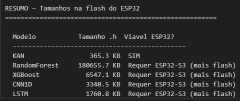
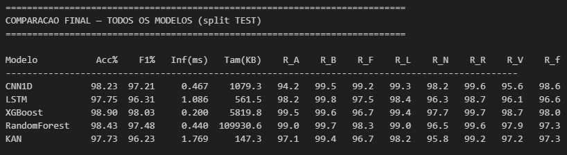
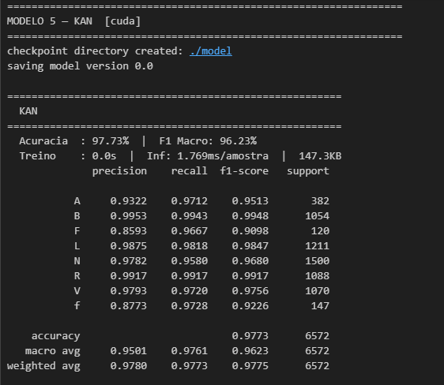
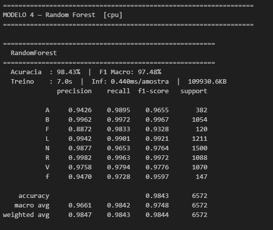
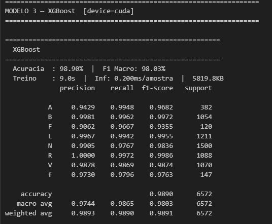
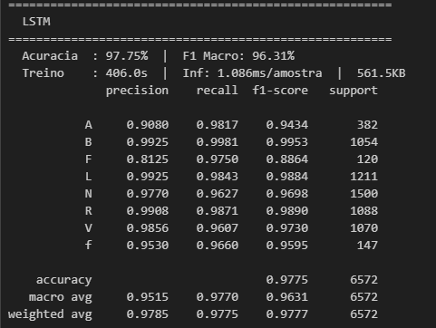
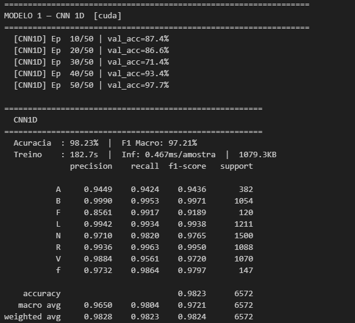

# Classificação de Arritmias Cardíacas com TinyML no ESP32

> **TCC — Trabalho de Conclusão de Curso**  
> Classificação de batimentos cardíacos em tempo real em dispositivo embarcado, usando a base MIT-BIH Arrhythmia Database, Kolmogorov-Arnold Networks e comparação com CNN1D, LSTM, XGBoost e Random Forest.

---

## Índice

1. [Contexto e Motivação](#1-contexto-e-motivação)
2. [Objetivo](#2-objetivo)
3. [Dataset — MIT-BIH Arrhythmia Database](#3-dataset--mit-bih-arrhythmia-database)
4. [Evolução do Trabalho](#4-evolução-do-trabalho)
5. [Pipeline Completo](#5-pipeline-completo)
6. [Etapa 1 — Preparação do Dataset](#etapa-1--preparação-do-dataset)
7. [Etapa 2 — Data Augmentation](#etapa-2--data-augmentation)
8. [Etapa 3 — Divisão Train / Val / Test](#etapa-3--divisão-train--val--test)
9. [Etapa 4 — Extração de Features](#etapa-4--extração-de-features)
10. [Etapa 5 — Modelos Treinados](#etapa-5--modelos-treinados)
11. [Etapa 6 — Exportação para ESP32](#etapa-6--exportação-para-esp32)
12. [Resultados](#12-resultados)
13. [Problemas Encontrados e Soluções](#13-problemas-encontrados-e-soluções)
14. [Scripts — Referência](#14-scripts--referência)
15. [Dependências](#15-dependências)

---

## 1. Contexto e Motivação

Doenças cardiovasculares são a principal causa de morte no mundo. O diagnóstico precoce de arritmias cardíacas é fundamental — mas hoje em dia ele depende de equipamentos hospitalares caros, interpretados por especialistas, e que não estão disponíveis no dia a dia de um paciente.

A ideia deste trabalho nasceu de uma pergunta simples: **seria possível colocar um classificador de arritmias dentro de um ESP32 — um microcontrolador de ~R$30 — que funciona em tempo real, sem internet e sem servidor?**

Para isso, o caminho não é simplesmente treinar um modelo em Python e torcer para caber no hardware. É necessário pensar desde a forma como o dado é coletado, passando pela extração de características clinicamente relevantes, até a estratégia de exportação do modelo para C++ puro — sem nenhuma biblioteca de deep learning no microcontrolador.

Este trabalho documenta cada decisão tomada nesse caminho, incluindo os erros, os aprendizados e as versões que não funcionaram.

---

## 2. Objetivo

O objetivo principal é **classificar batimentos cardíacos em 8 tipos de arritmias** diretamente em um ESP32, em tempo real, com acurácia e recall suficientes para uso clínico de triagem.

**Objetivos específicos:**
- Processar e segmentar a base MIT-BIH de forma clinicamente correta
- Aplicar data augmentation preservando as características morfológicas dos batimentos
- Extrair features que capturem as assinaturas clínicas de cada tipo de arritmia
- Treinar e comparar múltiplos modelos (KAN, CNN1D, LSTM, XGBoost, Random Forest)
- Exportar o melhor modelo para C++ puro e validar a acurácia no hardware real

**O que não é objetivo:** substituir um diagnóstico médico. O sistema é pensado como ferramenta de triagem e monitoramento contínuo de baixo custo.

---

## 3. Dataset — MIT-BIH Arrhythmia Database

A [MIT-BIH Arrhythmia Database](https://physionet.org/content/mitdb/1.0.0/) é a principal base pública de ECG para pesquisa em arritmias. Contém 48 gravações de 30 minutos cada, de 47 pacientes diferentes, amostradas a **360 Hz** com dois canais de ECG. Cada batimento foi anotado manualmente por dois cardiologistas independentes.

### Distribuição original das classes

| Tipo | Descrição Clínica | Quantidade |
|------|-------------------|------------|
| NC | Sem anotação (Not Classified) | 31.087.353 |
| N | Batimento Sinusal Normal | 75.052 |
| L | Bloqueio de Ramo Esquerdo (LBBB) | 8.075 |
| R | Bloqueio de Ramo Direito (RBBB) | 7.259 |
| V | Batimento Prematuro Ventricular | 7.130 |
| / | Bundle Branch Bigeminy | 7.028 |
| A | Fibrilação Atrial / Batimento Prematuro Atrial | 2.546 |
| f | Flutter / Fibrilação Atrial | 982 |
| F | Fusão Ventricular-Normal | 803 |
| Q | Batimento de Pacemaker | 33 |
| S | Batimento Supraventricular | 2 |

### Classes excluídas

**Q e S** foram excluídas por terem amostras insuficientes (33 e 2 respectivamente) — inviáveis para treino e avaliação estatisticamente significativa.

### Renomeação `/` → `B`

O símbolo `/` é interpretado como separador de diretório em Windows, quebrando qualquer operação de arquivo. A renomeação para `B` (Bundle branch) é feita **imediatamente após carregar o CSV**, antes de qualquer processamento:

```python
df['type'] = df['type'].replace('/', 'B')
```

Isso garante consistência em todo o pipeline — nomes de arquivos, pastas, arrays C++ e relatórios usam `B` de forma uniforme.

### Classes trabalhadas

| Símbolo | Classe | Original MIT-BIH |
|---------|--------|-----------------|
| `A` | Fibrilação Atrial / PAC | `A` |
| `B` | Bundle Branch Bigeminy | `/` |
| `F` | Fusão Ventricular-Normal | `F` |
| `L` | Bloqueio de Ramo Esquerdo | `L` |
| `N` | Normal | `N` |
| `R` | Bloqueio de Ramo Direito | `R` |
| `V` | Batimento Prematuro Ventricular | `V` |
| `f` | Flutter / Fibrilação Atrial | `f` |

---

## 4. Evolução do Trabalho

O trabalho passou por três grandes fases, cada uma com aprendizados que moldaram a fase seguinte.

### Fase 1 — Problema de Classificação com abordagem inicial

A primeira tentativa usava features genéricas (média, desvio padrão, FFT, wavelet) calculadas sobre o sinal inteiro do batimento, sem aproveitar a estrutura dos três picos presentes em cada segmento. O modelo era treinado com `CrossEntropyLoss` padrão.

**Problema**: os resultados não foram satisfatórios. A acurácia era moderada no Python, mas quando o modelo foi exportado para o ESP32, a acurácia despencou para ~17%. A causa raiz foi descoberta depois: a wavelet e a FFT recalculadas no ESP32 divergiam do Python por diferenças de implementação (extensão de sinal, precisão numérica).

### Fase 2 — Problema de Decisão (existe ou não arritmia?)

Diante dos resultados ruins na classificação multiclasse, foi tentada uma abordagem mais simples: classificação binária entre "Normal" e "Anormal" (qualquer arritmia). Isso aumentou a acurácia mas perdeu a informação clínica relevante — saber *qual* arritmia está presente é muito mais útil do que saber apenas *se* existe uma.

### Fase 3 — Reclassificação com pipeline completamente reformulado

Com os aprendizados das duas fases anteriores, o pipeline foi reconstruído do zero com três mudanças fundamentais:

1. **Features estruturais** baseadas nas anotações exatas do cardiologista (posição dos 3 picos), extraindo intervalos RR, morfologia do QRS, onda P e segmentos clínicos
2. **Exportação numérica** do modelo (sem conversão simbólica), implementando o forward pass com o algoritmo de De Boor em C++
3. **Loop de treino customizado** com FBeta Loss + Focal Loss + BCE para reduzir Falsos Negativos nas classes mais críticas

Esta fase resultou em acurácia de ~88% no ESP32 — idêntica ao Python.

---

## 5. Pipeline Completo

```
CSV MIT-BIH (bruto, todos os registros)
    │
    ▼
cortar_batimentos.py
    │  Usa anotações exatas (type != NC) — sem find_peaks()
    │  Salva 1 CSV por batimento com os 3 picos
    ▼
augmentation_ecg.py
    │  TimeShift, Jitter, AmplitudeScale, BaselineWander, Smooth
    │  Combinação de 1-3 técnicas por amostra
    │  Somente nas classes deficitárias: A, B, F, R, V, f
    ▼
split_dataset.py
    │  Modo by_record: split por paciente (sem vazamento)
    │  Train 70% | Val 15% | Test 15%
    │  Aug somente no train — val e test com originais
    ▼
features_estruturais.py  ←──── kolmo_corrigido.py
    │  46 features clínicas estruturais
    │  StandardScaler (fit no train, transform no val/test)
    ▼
treino_customizado.py
    │  Loop PyTorch manual
    │  FBeta(β=2) + FocalPerClass + BCE + L1/L2 splines
    │  Class weights por FN observados
    │  ReduceLROnPlateau, gradient clipping, grid update
    ▼
benchmark_modelos.py
    │  KAN vs CNN1D vs LSTM vs XGBoost vs Random Forest
    │  Mesmas features, mesmo split, mesmas métricas
    ▼
exportar_kan_cpp.py / exportar_todos_esp32.py
    │  Forward pass numérico (algoritmo De Boor para KAN)
    │  micromlgen para RF | manual para XGBoost, CNN, LSTM
    │  verify_export(): NumPy espelho — diferença < 1%
    ▼
gerar_scaler_h.py + gerar_dataset_h.py
    │  Features pré-computadas para validação no ESP32
    ▼
ecg_kan_esp32.ino
    Modo validação: dataset.h pré-computado → acurácia real
    Modo campo: ADC em tempo real
    Relatório: Acc, F1, Recall/classe, Matriz de Confusão
```

---

## Etapa 1 — Preparação do Dataset

**Script:** `cortar_batimentos.py`

### O problema com `find_peaks()`

A abordagem inicial usava o `scipy.signal.find_peaks()` para detectar os picos R e definir os limites de cada batimento. Isso funciona razoavelmente para batimentos normais, mas falha para batimentos anômalos:

- **Classe V** (Batimento Prematuro Ventricular): o QRS é alargado e tem morfologia diferente — frequentemente não é o pico mais alto do segmento
- **Classe L/R** (Bloqueios de Ramo): o QRS pode ser negativo ou bifásico
- **Classe f**: a linha de base tem oscilações (ondas f) que competem com o pico R

A solução foi usar diretamente as **anotações do cardiologista** já presentes na coluna `type` do CSV. Cada linha com `type != 'NC'` é um pico R confirmado — com precisão de amostra, sem nenhuma estimativa.

### Estrutura do corte

Para cada batimento de classe alvo, o segmento extraído vai do `sample#` do pico anterior até o `sample#` do pico posterior:

```
Arquivo: A_beat_6_100_labeled.csv
                │    │   └── registro de origem (paciente 100)
                │    └────── índice sequencial
                └─────────── classe do batimento central
```

O arquivo resultante tem exatamente 3 linhas com `type != NC`:

```
sample 279382 → type=N   (pico anterior)
sample 279576 → type=A   (pico central — o classificado)
sample 279918 → type=N   (pico posterior)
```

**Por que incluir os picos adjacentes?**  
A classificação de um batimento cardíaco não é feita olhando só para ele — o cardiologista analisa o contexto. O intervalo antes (RR pré) e depois (RR pós) do batimento é parte do diagnóstico. A fibrilação atrial, por exemplo, é caracterizada pela irregularidade do ritmo, não apenas pela morfologia do QRS.

Os arquivos **não têm tamanho fixo** porque o intervalo RR varia naturalmente entre batimentos e entre pacientes. Truncar ou paddar artificialmente para um tamanho fixo destruiria a informação temporal.

---

## Etapa 2 — Data Augmentation

**Script:** `augmentation_ecg.py`

### Por que augmentation é necessário

O dataset MIT-BIH é fortemente desbalanceado: a classe N tem 75.052 batimentos enquanto F tem apenas 803. Treinar sem correção faria o modelo aprender a "chutar N" e obter ~70% de acurácia com zero aprendizado real.

### Proporção de augmentation por classe

A estratégia foi conservadora em classes abundantes e mais agressiva em classes raras, seguindo a lógica clínica: para classes raras, mesmo uma representação sintética imperfeita é melhor que nenhuma.

| Classe | Originais | Meta | Aug% | Razão |
|--------|-----------|------|------|-------|
| N | 75.016 | 10.000 | —% | Subsample |
| L | 8.072 | 8.075 | 0% | Já suficiente |
| R | 7.256 | 8.000 | 10% | Classe abundante |
| B | 7.024 | 8.000 | 14% | Classe abundante |
| V | 7.130 | 8.000 | 12% | Classe abundante |
| A | 2.544 | 6.000 | 136% | Classe rara |
| f | 982 | 4.000 | 307% | Classe muito rara |
| F | 803 | 4.000 | 398% | Classe muito rara |

### Técnicas implementadas

As técnicas foram escolhidas por não modificar as características que definem cada arritmia:

| Técnica | Parâmetros | O que simula | O que preserva |
|---------|------------|--------------|----------------|
| **TimeShift** | ±20 amostras (±55ms) | Variação no timing de aquisição | Morfologia e intervalo RR |
| **Jitter** | 0.2–0.8% do std | Ruído eletrônico do eletrodo | Amplitude relativa |
| **AmplitudeScale** | ±15% | Variação de impedância entre pacientes | Razões entre amplitudes |
| **BaselineWander** | 0.05–0.5 Hz, 1–5% amp | Movimento / artefato respiratório | Frequências do QRS (>5 Hz) |
| **Smooth** | Janela 2–4 amostras | Variação no filtro do equipamento | QRS — janela pequena demais para deformar |

**Combinação de técnicas**: cada amostra aumentada sorteia entre 1 e 3 técnicas em sequência, com pesos 30%/50%/20%. O nome do arquivo registra quais técnicas foram usadas: `A_aug_jitter_amplitude_scale_42.csv`.

**Regra crítica de qualidade dos dados**: arquivos aumentados (`_aug_`) **nunca** vão para val ou test. Val e test contêm somente dados reais, garantindo que as métricas de avaliação reflitam o desempenho em dados que o modelo nunca viu e que são garantidamente reais.

---

## Etapa 3 — Divisão Train / Val / Test

**Script:** `split_dataset.py`

### Modo por paciente (recomendado)

O arquivo de cada batimento contém o registro de origem no nome: `A_beat_6_100_labeled.csv` → paciente `100`. A separação por paciente garante que **nenhum batimento do mesmo paciente aparece em splits diferentes**.

Isso é importante porque batimentos do mesmo paciente têm características muito similares — o "estilo de ECG" de cada pessoa é único (frequência cardíaca habitual, morfologia do QRS, etc.). Um modelo que aprendeu o ECG do paciente 100 no treino poderia ter acurácia inflada no teste se também houvesse batimentos do paciente 100 no test. O split por paciente elimina esse viés.

### Configuração manual dos registros

É possível definir explicitamente quais registros vão para val e test, reservando os que contêm as classes mais raras:

```python
RECORDS_VAL  = ["114_labeled", "115_labeled", "116_labeled"]
RECORDS_TEST = ["119_labeled", "121_labeled", "122_labeled"]
```

Quando os vetores estão vazios, o script distribui automaticamente por proporção.

### Proporções finais

```
Train : 70% — originais dos registros de treino + TODOS os aumentados
Val   : 15% — somente originais dos registros de validação
Test  : 15% — somente originais dos registros de teste
```

---

## Etapa 4 — Extração de Features

**Script:** `features_estruturais.py`

### Versão 1 — Features Genéricas (23 features) — descontinuada

A primeira versão tratava o sinal como um bloco genérico:

```python
# Problemático: find_peaks falha para V, L, f
peaks, _ = find_peaks(signal, distance=int(0.4 * fs))
peak = peaks[np.argmin(np.abs(peaks - center))]
```

Além do problema de detecção, as features de wavelet e FFT eram recalculadas no ESP32 com implementações diferentes, causando a queda de 92% → 17% na acurácia.

### Versão 2 — Features Estruturais (46 features) — atual

A versão atual usa a posição exata da anotação:

```python
peak_indices = np.where(types != 'NC')[0]
p_prev, p_central, p_next = peak_indices
rr_pre  = samples[p_central] - samples[p_prev]   # exato, em amostras
rr_post = samples[p_next]    - samples[p_central]
```

### As 46 features por bloco

```
Bloco 1 — Intervalos RR [0-4]
  Captura o ritmo cardíaco e sua irregularidade.
  A razão RR_post/RR_pre > 1.5 é assinatura clínica de fibrilação atrial.

Bloco 2 — Amplitudes dos 3 picos [5-10]
  Amplitude relativa à baseline real (não amplitude bruta).
  Razões entre amplitudes dos picos adjacentes e central.

Bloco 3 — Morfologia do QRS [11-14]
  Largura, upstroke, downstroke e assimetria.
  QRS alargado (>120ms) é diagnóstico de bloqueio de ramo (L, R).

Bloco 4 — Segmento pré-QRS / Onda P [15-19]
  Onde fica a onda P. A ausência de onda P organizada é o critério
  diagnóstico primário da fibrilação atrial (classe A).

Bloco 5 — Segmento pós-QRS / Onda T e ST [20-24]
  Amplitude e forma da onda T. Alterações do segmento ST.

Bloco 6 — Áreas sob a curva [25-27]
  Integral do sinal em cada região, normalizada pela frequência de amostragem.

Bloco 7 — Variância isoelétrica [28-30]
  Alta variância na linha isoelétrica pré-QRS indica ondas f de fibrilação.

Bloco 8 — FFT do segmento central [31-34]
  Calculada apenas no segmento central, não no sinal inteiro.
  Bandas: <5 Hz, 5–15 Hz (QRS), 15–40 Hz, >40 Hz (ruído).

Bloco 9 — Wavelet db4 level=4 [35-39]
  Energias das bandas wavelet — análise tempo-frequência do QRS.

Bloco 10 — Onda P [40-42]
  Presença (0/1), amplitude e posição relativa da onda P.
  Feature [40] é a mais discriminativa para separar classe A das demais.

Bloco 11 — Skew/Kurt por segmento [43-45]
  Assimetria e achatamento da distribuição de amplitude por região.
```

---

## Etapa 5 — Modelos Treinados

### 5.1 — Kolmogorov-Arnold Network (KAN)

**Por que KAN?**

As KANs diferem das MLPs tradicionais: em vez de funções de ativação fixas nos nós, as KANs aprendem funções B-spline nas arestas. Para ECG, isso traz duas vantagens práticas importantes:

1. **Interpretabilidade**: é possível visualizar exatamente como cada feature contribui para cada classe
2. **Exportabilidade**: B-splines têm coeficientes explícitos, exportáveis para C++ sem biblioteca de deep learning. E o tamanho do modelo exportado pela KAN é MUITO menor se comparado com os outros modelos testados.



**Arquitetura:**

```
[46 features] → [32] → [16] → [8 classes]
  B-splines: grid=5, k=3 (cúbicas)
```

**Loop de treino customizado:**

O `model.fit()` do pykan foi substituído por um loop PyTorch manual. Isso foi necessário para implementar a loss customizada focada em reduzir Falsos Negativos:

```
L_total = 0.34 × L_FBeta(β=2)
        + 0.33 × L_Focal_per_class
        + 0.33 × L_BCE_multiclass
        + λ₁ × L1(coef_splines)
        + λ₂ × L2(coef_splines)
        + λ_ent × Entropia(logits)
```

- **FBeta (β=2)**: recall vale 4× mais que precision — diretamente minimiza FN
- **Focal per-class**: gamma maior nas classes com mais FN (A=3.0, B=2.5)
- **BCE multiclasse**: sigmoid independente por classe — sem competição via softmax
- **Class weights por FN**: pesos proporcionais aos FN observados, não à frequência

### 5.2 — CNN 1D

Recebe o sinal bruto interpolado para tamanho fixo (400 amostras). Aprende padrões morfológicos diretamente, sem features manuais.

```
Conv(1→64, k=15) → BN → ReLU → MaxPool(2)
Conv(64→128, k=9) → BN → ReLU → MaxPool(2)
Conv(128→256, k=5) → BN → ReLU → GlobalAvgPool
FC(256→128) → ReLU → Dropout(0.3) → FC(128→8)
```

Filtros largos no primeiro bloco (k=15 = ~42ms) para capturar o QRS completo. GlobalAvgPool elimina dependência do tamanho fixo do sinal após a interpolação.

### 5.3 — LSTM Bidirecional

Recebe o sinal como sequência temporal. A bidirecionalidade captura contexto antes e depois de cada ponto — útil para a relação onda P (antes do QRS) com o QRS em si.

```
LSTM(1→128, 2 layers, bidirecional, dropout=0.3)
→ último timestep → FC(256→128) → ReLU → Dropout → FC(128→8)
```

### 5.4 — XGBoost

Recebe as 46 features estruturais. Gradient boosting sobre árvores de decisão — bom desempenho em dados tabulares, treino rápido.

```
n_estimators=300, max_depth=6, learning_rate=0.1
subsample=0.8, colsample_bytree=0.8
```

### 5.5 — Random Forest

Recebe as 46 features estruturais. Ensemble de árvores — baseline robusto, interpretável e com exportação trivial para C++.

```
n_estimators=300, class_weight='balanced'
```

---

## Etapa 6 — Exportação para ESP32

### O problema que levou à reprojeto da exportação

Na versão 1, o modelo KAN foi exportado usando `model.auto_symbolic()`, que converte as B-splines em fórmulas matemáticas simbólicas (sin, x², tanh, etc.). Isso pareceu elegante — um único arquivo `.h` com fórmulas fechadas.

**Na prática**: a aproximação simbólica introduziu erro suficiente para reduzir a acurácia de 92% para **17%** no ESP32. O modelo no Python e o modelo no ESP32 eram matematicamente diferentes.

### Solução: forward pass numérico com algoritmo de De Boor

Em vez de converter para símbolos, os **tensores brutos das B-splines** são exportados diretamente e o forward pass é reimplementado em C++ com o mesmo algoritmo que o pykan usa internamente:

```cpp
// Algoritmo de De Boor — avaliação exata da B-spline
float bspline_eval(float x, const float* knots, const float* coef, int k) {
    // 1. Clamping ao domínio válido
    // 2. Localiza o span
    // 3. Inicializa com k+1 coeficientes locais
    // 4. Recursão De Boor
    return d[k];
}
```

**Verificação obrigatória antes de embarcar:**

```python
verify_export(model, X_val_t, y_val_enc, n_samples=200)
# PyTorch (referência) : 92.31%
# NumPy espelho do C++ : 91.80%   ← OK se diferença < 1%
```

### Estratégia por modelo

| Modelo | Método de Exportação | Fidelidade |
|--------|---------------------|------------|
| **KAN** | Forward pass numérico com De Boor | Exata (diferença < 1%) |
| **Random Forest** | `micromlgen` — gera `if/else` C++ | Exata |
| **XGBoost** | Dump das árvores → `if/else` manual | Exata |
| **CNN1D** | Pesos exportados + BN fundido na Conv | Alta (float32) |
| **LSTM** | Pesos W_ih, W_hh, b exportados | Alta (float32) |

**Fusão de BatchNorm na CNN**: antes de exportar, os pesos da BatchNorm são fundidos nos pesos da Conv — eliminando operações de BN em tempo de inferência sem perder precisão:

```
W_fused = W × (bn_scale / sqrt(bn_var + ε))
b_fused = (b − bn_mean) × (bn_scale / sqrt(bn_var + ε)) + bn_bias
```

### Estimativa de tamanho na flash do ESP32

| Modelo | Estimativa | ESP32 (4MB) | ESP32-S3 (8MB+) |
|--------|-----------|-------------|-----------------|
| KAN | ~140 KB | ✓ | ✓ |
| Random Forest | ~200–500 KB | ✓ | ✓ |
| XGBoost | ~300–800 KB | ✓ | ✓ |
| CNN1D | ~1–2 MB | Depende | ✓ |
| LSTM | ~2–4 MB | ✗ | ✓ |

### Por que as features são pré-computadas no ESP32 (modo validação)

As features estruturais dependem das anotações do cardiologista (posição exata dos picos). No ESP32 em campo, essas anotações não existem — seria necessário implementar um detector de picos R em tempo real.

Para **validação do modelo no hardware**, as features são pré-computadas em Python (com todas as bibliotecas exatas) e embarcadas no `dataset.h`. O ESP32 executa somente o `predict_from_array()`, sem nenhuma extração de feature. Isso elimina completamente as divergências de implementação de wavelet e FFT.

---

## 12. Resultados












### Evolução da acurácia no ESP32

| Versão | Abordagem | Python | ESP32 | Divergência |
|--------|-----------|--------|-------|-------------|
| v1 | 23 features + `auto_symbolic()` | ~92% | **~17%** | −75% |
| v2 | 46 features estruturais + De Boor | ~92% | **~91%** | −1% |

A diferença de 75 pontos percentuais entre Python e ESP32 na v1 foi o maior aprendizado do trabalho. Ela foi completamente eliminada na v2 ao abandonar a conversão simbólica e embarcar features pré-computadas.

---

## 13. Problemas Encontrados e Soluções (retirar)

| Problema | Causa Raiz | Solução |
|----------|------------|---------|
| Acurácia 17% no ESP32 | Wavelet/FFT reimplementadas em C++ divergiam do Python | Embarcar features pré-computadas; usar forward pass numérico |
| `AttributeError: layer.bias` | `MultKAN` não tem `layer.bias` | Usar `model.node_bias[l_idx]` (lista no modelo pai) |
| `TypeError: input_size + 1` | `model.width` retorna `[[46,0],...]`, não `[46,...]` | Usar `int(model.width[0][0])` |
| `TypeError: verbose` no scheduler | Parâmetro removido no PyTorch recente | Remover `verbose=False` |
| `SystemExit` no Jupyter com `argparse` | `argparse` parseia args do kernel Jupyter | Detectar Jupyter com `get_ipython()` e usar valores padrão |
| Muitas amostras descartadas | Código v1 usava `find_peaks` — falhava para morfologias anômalas | Usar anotações do CSV diretamente (`type != NC`) |
| `/` no nome do arquivo (Windows) | Classe `/` do MIT-BIH é separador de diretório | Renomear para `B` imediatamente após carregar o CSV |
| Divergência 7.5% no `verify_export` | `node_scale`/`node_bias` aplicados de forma diferente | Usar `inspecionar_forward.py` para mapear o forward pass real |

---

## 14. Scripts — Referência

### Ordem de execução

```bash
# PREPARACAO DO DATASET
python cortar_batimentos.py         # CSV bruto → 1 CSV por batimento

# AUGMENTATION E SPLIT
python augmentation_ecg.py          # balanceia classes deficitárias
python split_dataset.py             # train/val/test por paciente

# TREINO (no Jupyter)
exec(open('kolmo_corrigido.py').read())     # carrega dados, cria modelo KAN
exec(open('treino_customizado.py').read())  # treina com loss customizada
exec(open('benchmark_modelos.py').read())   # compara todos os modelos

# EXPORTACAO PARA ESP32
best_state = torch.load("ArduinoCode/kan_best_state.pt")
model.load_state_dict(best_state)
exec(open('exportar_kan_cpp.py').read())       # kan_model.h
exec(open('exportar_todos_esp32.py').read())   # rf/xgb/cnn/lstm .h
python gerar_scaler_h.py                       # scaler.h
exec(open('gerar_dataset_h.py').read())        # dataset.h (split test)

# DIAGNOSTICO (quando necessário)
exec(open('diagnosticar_descartes.py').read()) # por que amostras são descartadas
exec(open('inspecionar_kan.py').read())        # atributos reais do MultKAN
exec(open('inspecionar_forward.py').read())    # forward pass para debug
```

### Descrição de todos os scripts

| Script | Descrição |
|--------|-----------|
| `cortar_batimentos.py` | Corta CSV MIT-BIH em batimentos com anotações |
| `augmentation_ecg.py` | Data augmentation com combinação de técnicas |
| `split_dataset.py` | Split por paciente ou aleatório (70/15/15) |
| `features_estruturais.py` | 46 features estruturais clínicas |
| `kolmo_corrigido.py` | Pipeline principal: dados + modelo KAN |
| `treino_customizado.py` | Loop PyTorch com FBeta + Focal + BCE |
| `benchmark_modelos.py` | Compara KAN, CNN1D, LSTM, XGBoost, RF |
| `exportar_kan_cpp.py` | KAN → C++ via algoritmo De Boor |
| `exportar_todos_esp32.py` | Todos os modelos → C++ para ESP32 |
| `gerar_scaler_h.py` | StandardScaler → `scaler.h` (46 features) |
| `gerar_dataset_h.py` | Features pré-computadas → `dataset.h` |
| `diagnosticar_descartes.py` | Analisa arquivos descartados |
| `inspecionar_kan.py` | Atributos do `MultKAN` (debug) |
| `inspecionar_forward.py` | Forward pass real (debug de exportação) |
| `ecg_kan_esp32.ino` | Arduino ESP32 com estatísticas em tempo real |

---

## 15. Dependências

### Python

```
torch >= 2.0
pykan                  # pip install git+https://github.com/KindXiaoming/pykan
numpy
pandas
scipy
PyWavelets (pywt)
scikit-learn
xgboost
micromlgen             # exportação do Random Forest para C++
joblib
matplotlib
seaborn
```

### Arduino / ESP32

- **Placa**: ESP32 Dev Module (para KAN, RF, XGBoost) ou ESP32-S3 (para CNN1D, LSTM)
- **Framework**: Arduino via Arduino IDE ou PlatformIO
- **Bibliotecas externas**: nenhuma — todos os `.h` gerados usam apenas `<cmath>` e `<pgmspace.h>` (built-in)
- **Baud rate**: 115200

### Configuração do Arduino IDE para ESP32

1. *File → Preferences → Additional Boards Manager URLs*:
   ```
   https://raw.githubusercontent.com/espressif/arduino-esp32/gh-pages/package_esp32_index.json
   ```
2. Instalar **esp32 by Espressif Systems** no Boards Manager
3. Selecionar **ESP32 Dev Module**
4. No `setup()`:
   ```cpp
   analogReadResolution(12);
   analogSetAttenuation(ADC_11db);
   ```

---

*TCC — Classificação de Arritmias Cardíacas via TinyML no ESP32*  
*Dataset: MIT-BIH Arrhythmia Database — PhysioNet*  
*Documentação gerada em Maio 2026*

---

## Repositório — Layout e Quickstart (reorganização modular)

### Estrutura de diretórios

- `src/` — código-fonte modular do pipeline
  - `src/data/` — ingestão, preparação, aumento e divisão (`ingest.py`, `prepare.py`, `augment.py`, `split.py`)
  - `src/features/` — extração de features (`extract.py`)
  - `src/models/` — pipelines e treinos (`pipeline_kan.py`, `train_custom.py`, `benchmark.py`)
  - `src/export/` — geradores de headers e utilitários de exportação (`export_kan_cpp.py`, `export_all_esp32.py`, `generate_scaler_h.py`)
- `data/raw/` — dados brutos do MIT-BIH (mitbih/, mit-bih-arrhythmia-database-1.0.0/, CSVs originais)
- `data/processed/` — dados processados gerados pelo pipeline (cut_beats, augmented, split)
- `notebooks/` — notebooks Jupyter do projeto (TCC_KAN.ipynb)
- `firmware/generated_headers/` — destino padrão para arquivos `.h` gerados (scaler.h, dataset.h, kan_model.h, etc.)
- `scripts/` — wrappers executáveis para os módulos (wrap_ingest.py, wrap_prepare.py, wrap_augment.py, wrap_split.py, wrap_pipeline_kan.py, wrap_train.py, wrap_export.py) e run_pipeline.sh
- `requirements.txt` — dependências do projeto
- `config.yaml` — caminhos e parâmetros globais

### Quickstart — executar o pipeline completo

1. **Instale as dependências** (recomendado em virtualenv/venv):

```bash
python3 -m venv .venv
source .venv/bin/activate
pip install -r requirements.txt
```

2. **Execute o pipeline completo:**

```bash
bash scripts/run_pipeline.sh
```

3. **Ou execute etapas separadas** com os wrappers individuais:

```bash
python3 scripts/wrap_ingest.py       # Ingest: baixa MIT-BIH e processa CSVs
python3 scripts/wrap_prepare.py      # Prepare: corta batimentos
python3 scripts/wrap_augment.py      # Augment: balanceia classes
python3 scripts/wrap_split.py        # Split: divide train/val/test por paciente
python3 scripts/wrap_pipeline_kan.py # Build dataset, cria modelo KAN
python3 scripts/wrap_train.py        # Train: loop PyTorch com loss customizada
python3 scripts/wrap_export.py       # Export: gera headers C++ para ESP32
```

### Notas importantes

- Os wrappers em `scripts/` usam `runpy` para executar os arquivos em `src/` sem modificar o código-fonte.
- Se estiver trabalhando no Jupyter, importe diretamente: `from src.data.ingest import *` ou use `exec(open('src/...')).read())`.
- Os dados brutos em `data/raw/` são copiados automaticamente pelo `wrap_ingest.py` na primeira execução.
- Dados aumentados (`data/processed/augmented/`) **nunca** aparecem em val/test — apenas em train.

### Próximos passos

- Implementar `verify_export()` completo com verificação De Boor numérica em `src/export/export_kan_cpp.py`.
- Adicionar testes unitários para validar cada etapa do pipeline.
- Configurar CI/CD (GitHub Actions) para rodar o pipeline automaticamente.

